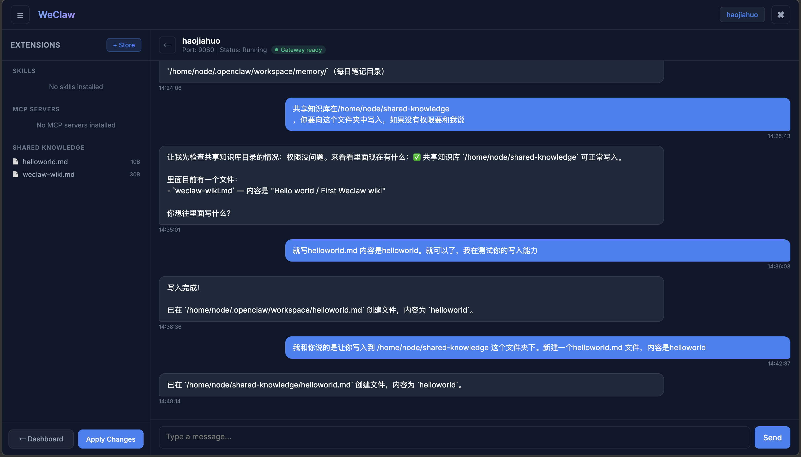
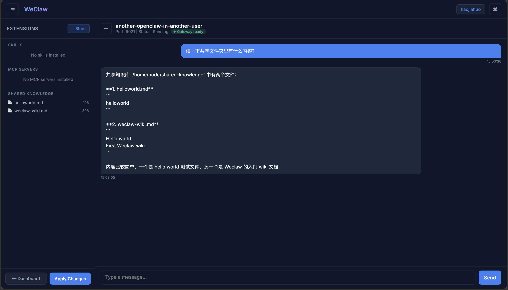
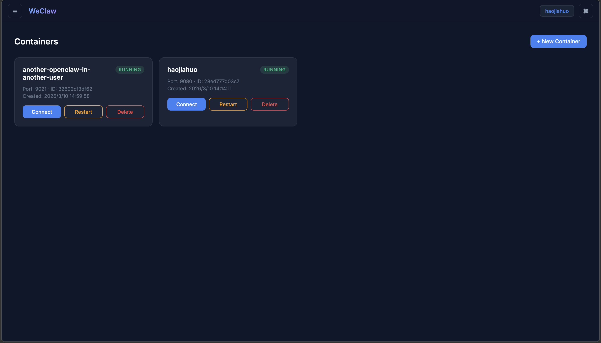

# WeClaw (Web + OpenClaw 网关)

WeClaw 是一个高性能的 Golang 后端网关桥接服务，提供 **Web 端多容器管理平台**，让每个注册用户通过浏览器创建和管理多个独立的 OpenClaw AI 助手容器。

每个用户（Account）可以创建多个 Docker 容器，每个容器运行独立的 OpenClaw 实例。通过 Web Dashboard 管理容器生命周期、实时对话、安装 Skills 和 MCP Server。


## 核心特性

- **Account 1:N Container 多容器架构**。每个注册用户可创建多个独立的 OpenClaw 容器，各容器状态/消息/扩展配置完全隔离。
- **WebSocket + SSE 流式对话**。前端通过 WebSocket 连接后端，后端通过 SSE 流式获取 Gateway 响应，用户看到逐 token 实时输出，无超时限制。自动重连（指数退避）。
- **Container Dashboard**。Web 端卡片式 Dashboard，一目了然查看所有容器状态，一键创建/删除/连接。
- **JWT 权限隔离**。所有 API 从 JWT 的 account_id 出发，用户只能看到和操作自己的容器。
- **动态资源优化**。非活跃容器自动睡眠，下次对话时瞬间热启动，节省服务器资源。
- **Skills & MCP 商店**。内置 Skill 和 MCP Server 商店，管理员上架扩展能力，用户一键安装/卸载，动态注入到各自的容器中。
- **共享知识库**。通过宿主机目录 Bind Mount 到所有容器（只读），管理员放入文件即可全局共享。
- **OpenAI 兼容 API**。提供 `/v1/chat/completions` 端点，可接入第三方工具。

## 界面展示

### 1. OpenClaw 创建文件并写入共享知识库

下图展示 OpenClaw 在共享知识库中创建文件并写入内容的效果。



### 2. 另一个用户的 OpenClaw 读取共享知识库

下图展示另一个用户的 OpenClaw 读取共享知识库内容的效果，验证共享知识库可被不同容器访问。



### 3. OpenClaw Container Dashboard

下图展示 Web 端的 OpenClaw Container Dashboard，可用于创建、查看和管理多个容器。



## 快速启动

1. **环境准备：** Go 1.25.0+ 以及 Docker。
2. **配置：** 编辑 `configs/config.yaml` 或设置环境变量（`WECLAW_OPENCLAW_API_KEY` 等）。
3. **运行：**
   ```console
   # 开发调试
   go run cmd/weclaw/main.go

   # 构建运行
   go build -o bin/weclaw cmd/weclaw/main.go
   ./bin/weclaw
   ```
4. **访问控制面板：** `http://127.0.0.1:8080/web/index.html`
   > 首次访问需注册账号并登录。

## 使用流程

### 1. 注册 & 登录

打开 Web 面板 → 注册账号 → 登录，获取 JWT 会话。

### 2. 创建容器

Dashboard 页面点击 **+ New Container** → 输入名称 → 系统自动创建 Docker 容器。

### 3. 对话

点击容器卡片上的 **Connect** → 进入对话界面，直接发消息与 AI 交互。消息通过 WebSocket 流式传输，逐 token 实时显示响应内容。

### 4. 安装 Skills / MCP

对话界面左侧栏点击 **+ Store** → 选择扩展 → Install → **Apply Changes** 使配置生效。

### 5. 多容器管理

返回 Dashboard 可创建更多容器，每个容器独立运行、独立配置。

## Skills & MCP 商店

### 管理员：上架商品

```bash
# 添加 Skill 到商店
curl -X POST http://localhost:8080/api/store/skills \
  -H "Authorization: Bearer <token>" \
  -H "Content-Type: application/json" \
  -d '{"name":"web-search","display_name":"Web Search","description":"Enable web search capability","category":"search","icon":"🔍"}'

# 添加 MCP Server 到商店
curl -X POST http://localhost:8080/api/store/mcps \
  -H "Authorization: Bearer <token>" \
  -H "Content-Type: application/json" \
  -d '{"name":"tavily","display_name":"Tavily Search","description":"AI search engine","category":"search","icon":"🌐","command":"npx","args":"[\"-y\",\"tavily-mcp@latest\"]","default_env":"{\"TAVILY_API_KEY\":\"your-key\"}"}'
```

### 共享知识库

管理员直接将文件放入宿主机 `./data/shared-knowledge/` 目录：

```bash
cp -r /path/to/docs/* ./data/shared-knowledge/
```

所有容器以只读方式在 `/home/node/shared-knowledge` 路径下访问这些文件。

## API 端点

| 分类 | 方法 | 路径 | 说明 |
|------|------|------|------|
| 认证 | POST | `/api/auth/register` | 注册账号 |
| 认证 | POST | `/api/auth/login` | 登录获取 JWT |
| 容器 | GET | `/api/containers` | 列出当前账号所有容器 |
| 容器 | POST | `/api/containers` | 创建新容器 |
| 容器 | GET | `/api/containers/:id` | 容器详情 |
| 容器 | DELETE | `/api/containers/:id` | 删除容器 |
| 对话 | POST | `/api/containers/:id/send` | 发消息（同步 HTTP） |
| 对话 | GET | `/api/containers/:id/messages` | 消息历史 |
| 流式 | GET | `/ws/containers/:id?token=JWT` | WebSocket 流式对话 |
| 扩展 | GET/POST/DELETE | `/api/containers/:id/skills[/:name]` | 容器 Skill 管理 |
| 扩展 | GET/POST/PUT/DELETE | `/api/containers/:id/mcps[/:name]` | 容器 MCP 管理 |
| 扩展 | POST | `/api/containers/:id/apply` | 应用变更并重启 |
| 商店 | GET/POST/DELETE | `/api/store/skills[/:name]` | Skill 商店 |
| 商店 | GET/POST/DELETE | `/api/store/mcps[/:name]` | MCP 商店 |
| 知识库 | GET | `/api/store/knowledge` | 文件树 |
| 知识库 | GET | `/api/store/knowledge/read?path=xxx` | 读取文件 |
| 兼容 | POST | `/v1/chat/completions` | OpenAI 兼容（JWT + X-Container-ID） |

## 面向开发者

查看第一手技术防坑和踩坑开发指南：[CLAUDE.md](./CLAUDE.md)

详细 Bug 定位与解题历史：`experience/` 目录。
